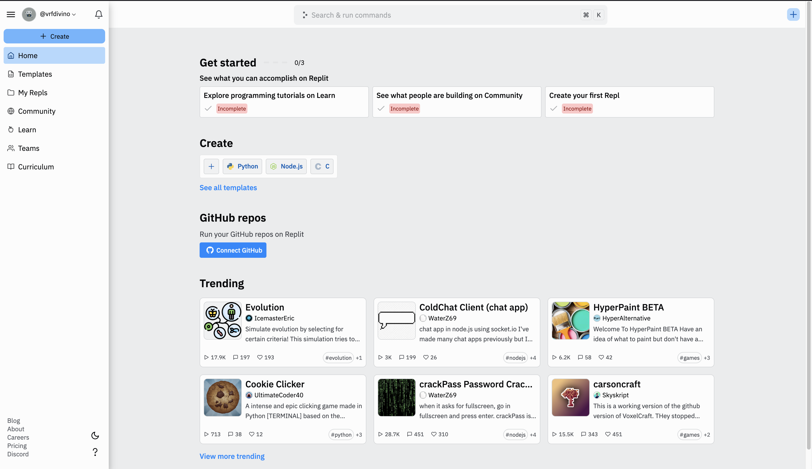
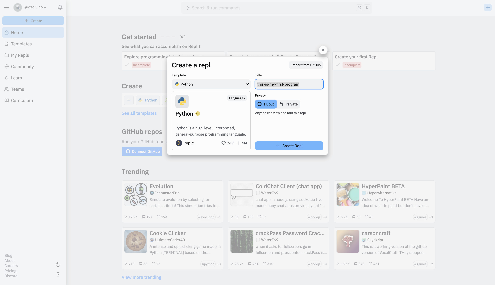
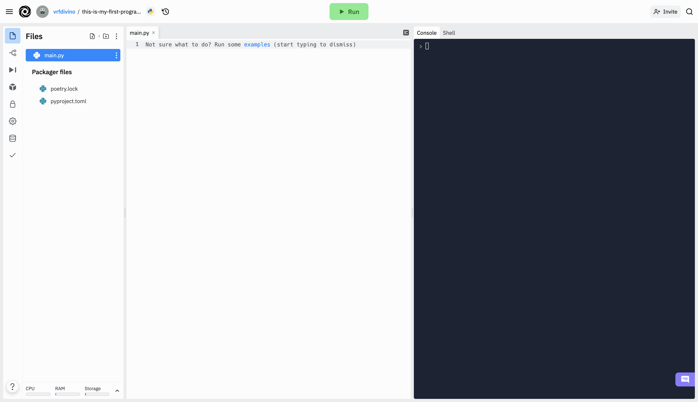

# Why Python3?

For this course, you will learn the fundamentals of programming using Python3. [Python](https://www.python.org/) is a powerful, easy-to-use programming language that can be used to solve and build softwares such as in web development, scripting, data science and many more. Python3 is just a version of Python, which is the most recent one. We will be using the said version for this course. Python is great language to teach to beginners since it is not too verbose and its syntax is easy to understand -- just like old plain English.

# Setting up your environment

Before we can write our first program, we should be able to setup our environment. You can think of a programming environment like a treasure box, where all of the tools needed are there for you to start developing programs. It can also be called a IDE, or basically a code editor.

For this course, we will simplify setting up our environment so that you don't get overwhelemed. When you are comfortable enough, maybe after completing course, you could setup your own enviroment. But right now, I believe a simple setup will do.

We will use [Replit.com](https://replit.com/) to setup our environment. Visit the page and sign up for an account. Once you complete the sign up process, you will be redirected to your own dashboard. This is what it should look like:



Now, once you already in your own dashboard. Click the `Create` button. A pop-up will show and select `Python` as the repl template. You can name your repl whatever you want. For example, I created a new repl with a `Python` template named `this-is-my-first-program`. Then, click the `Create Repl` button to finish.



You should be able to see an interface that looks like below. Congratulations! You are now ready to write your first Python program.



# Getting started

I assume that you completed the instructions above to setup your Repl editor. Right now, we will write your first line of code in Python. A `Repl` is a fancy word for a coding project. As you can see, in the left side, there is a section named `Files`. In this section, you can see all of your project files such `main.py` as an example. In the middle section, this is called the `editor`. This is where we write our code. And lastly, the right most side is the `console/shell`, this is where we can interact with the running program.

To get started, click the `main.py` file. In your `editor`, type this awesome line of code:

```python3
print("Hello, World!")
```

At the upper part of your screen, you should be able to see a green button with a label, `Run`. Click the button and see what will happen. It display `Hello, World!` in your `console`.


Wow! You are now ready to start learning the course! Good luck, and have fun!
